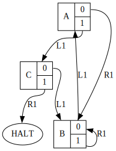
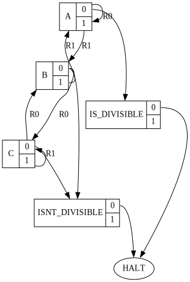

## Overview

You can find an explanation of what a Turing machine is [on
Wikipedia](https://en.wikipedia.org/wiki/Turing_machine). This program takes a
description of a Turing machine as a JSON file, and runs it, printing out the
state of the machine at each step and continuing until some condition has been
reached, such as an error state, a halting state, or a set number of steps have
been reached.

## Features

- Finite-space simulation of a Turing Machine
- Output state diagram in the GraphViz Dot language
- JSON input files
- Included sample input
- Ability to specify initial state information in input file
- A special `HALT` state for simulation termination
- Utilizes the cJSON library to process input files
- Familiar user interface based on other Linux programs

## Examples

### Busy Beaver

<p align="center">
  
</p>

This is the traditional "busy beaver" program. The head (signified with an 'h')
moves left and right on the tape, populating each space it covers with a '1'.

```
|                   h                 | A
|                   1h                | B
|                   h1                | A
|                  h11                | C
|                 h111                | B
|                h1111                | A
|                1h111                | B
|                11h11                | B
|                111h1                | B
|                1111h                | B
|                11111h               | B
|                1111h1               | A
|                111h11               | C
```

The input file looks like this:

```json
{
  "start_offset": 40,
  "states": [
    {"state": "A", "tape_symbol": " ", "write_symbol": "1", "direction": "R", "next_state": "B"},
    {"state": "A", "tape_symbol": "1", "write_symbol": "1", "direction": "L", "next_state": "C"},
    {"state": "B", "tape_symbol": " ", "write_symbol": "1", "direction": "L", "next_state": "A"},
    {"state": "B", "tape_symbol": "1", "write_symbol": "1", "direction": "R", "next_state": "B"},
    {"state": "C", "tape_symbol": " ", "write_symbol": "1", "direction": "L", "next_state": "B"},
    {"state": "C", "tape_symbol": "1", "write_symbol": "1", "direction": "R", "next_state": "HALT"}
  ]
}
```

### Divisible by 3

<p align="center">
  
</p>

This example shows a machine that takes a number as the initial state and
replies whether the number is divisible by 3 or not. The input number in this
case is 39847239813, and is divisible by 3, so the final state is
`IS_DIVISIBLE`.

```
|h0100101000111000101001010000010000101                                         | A
|0h100101000111000101001010000010000101                                         | A
|00h00101000111000101001010000010000101                                         | A
|001h0101000111000101001010000010000101                                         | B
|0010h101000111000101001010000010000101                                         | C
|00100h01000111000101001010000010000101                                         | B
|001001h1000111000101001010000010000101                                         | A
|0010010h000111000101001010000010000101                                         | A
|00100101h00111000101001010000010000101                                         | B
|001001010h0111000101001010000010000101                                         | C
|0010010100h111000101001010000010000101                                         | B
|00100101000h11000101001010000010000101                                         | C
|001001010001h1000101001010000010000101                                         | C
|0010010100011h000101001010000010000101                                         | C
|00100101000111h00101001010000010000101                                         | C
|001001010001110h0101001010000010000101                                         | B
|0010010100011100h101001010000010000101                                         | C
|00100101000111000h01001010000010000101                                         | B
|001001010001110001h1001010000010000101                                         | A
|0010010100011100010h001010000010000101                                         | A
|00100101000111000101h01010000010000101                                         | B
|001001010001110001010h1010000010000101                                         | C
|0010010100011100010100h010000010000101                                         | B
|00100101000111000101001h10000010000101                                         | A
|001001010001110001010010h0000010000101                                         | A
|0010010100011100010100101h000010000101                                         | B
|00100101000111000101001010h00010000101                                         | C
|001001010001110001010010100h0010000101                                         | B
|0010010100011100010100101000h010000101                                         | C
|00100101000111000101001010000h10000101                                         | B
|001001010001110001010010100000h0000101                                         | C
|0010010100011100010100101000001h000101                                         | C
|00100101000111000101001010000010h00101                                         | B
|001001010001110001010010100000100h0101                                         | C
|0010010100011100010100101000001000h101                                         | B
|00100101000111000101001010000010000h01                                         | C
|001001010001110001010010100000100001h1                                         | C
|0010010100011100010100101000001000010h                                         | B
|00100101000111000101001010000010000101h                                        | A
|00100101000111000101001010000010000101h                                        | IS_DIVISIBLE
```

The input file for this machine looks like this:

```json
{
  "initial_tape": "00100101000111000101001010000010000101",
  "states": [
    {"state": "A", "tape_symbol": "0", "write_symbol": "0", "direction": "R", "next_state": "A"},
    {"state": "A", "tape_symbol": "1", "write_symbol": "1", "direction": "R", "next_state": "B"},
    {"state": "B", "tape_symbol": "0", "write_symbol": "0", "direction": "R", "next_state": "C"},
    {"state": "B", "tape_symbol": "1", "write_symbol": "1", "direction": "R", "next_state": "A"},
    {"state": "C", "tape_symbol": "0", "write_symbol": "0", "direction": "R", "next_state": "B"},
    {"state": "C", "tape_symbol": "1", "write_symbol": "1", "direction": "R", "next_state": "C"},
    {"state": "A", "tape_symbol": " ", "write_symbol": " ", "direction": "N", "next_state": "IS_DIVISIBLE"},
    {"state": "B", "tape_symbol": " ", "write_symbol": " ", "direction": "N", "next_state": "ISNT_DIVISIBLE"},
    {"state": "C", "tape_symbol": " ", "write_symbol": " ", "direction": "N", "next_state": "ISNT_DIVISIBLE"},
    {"state": "IS_DIVISIBLE", "tape_symbol": " ", "write_symbol": " ", "direction": "N", "next_state": "HALT"},
    {"state": "ISNT_DIVISIBLE", "tape_symbol": " ", "write_symbol": " ", "direction": "N", "next_state": "HALT"}
  ]
}
```

## Usage

Here is a synopsis of how to use the program:

```
Usage: turing_machine [file]
 -g,--graph     Create a graphviz diagram of the input state machine.
 -h,--help      Print this usage message.
 -v,--verbose   Display additional logging information.
```

## Dependencies

There are no dependencies for this repository besides a C compiler, and possibly
Make, however, you probably want Graphviz installed if you want to produce a
state machine graph.

## License

This work is licensed under the GNU General Public License version 3 (GPLv3).

[](https://www.gnu.org/licenses/gpl-3.0.en.html)
